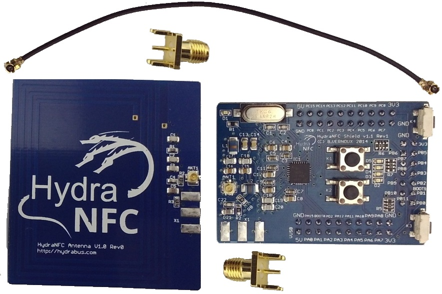

HydraNFC Shield and HydraNFC Antenna
========

HydraNFC hardware shield

The HydraNFC is an NFC shield hardware to sniff, read/write or emulate any 13.56MHz NFC tags for anyone interested in debugging/hacking/developing for NFC.
It has been designed to be used with HydraBus see https://github.com/bvernoux/hydrabus but can also be used with other MCU.

Will include open source code firmware(For HydraBus) and HydraNFC schematics.

For more details on the hardware and where to buy it see http://hydrabus.com/?page_id=30
